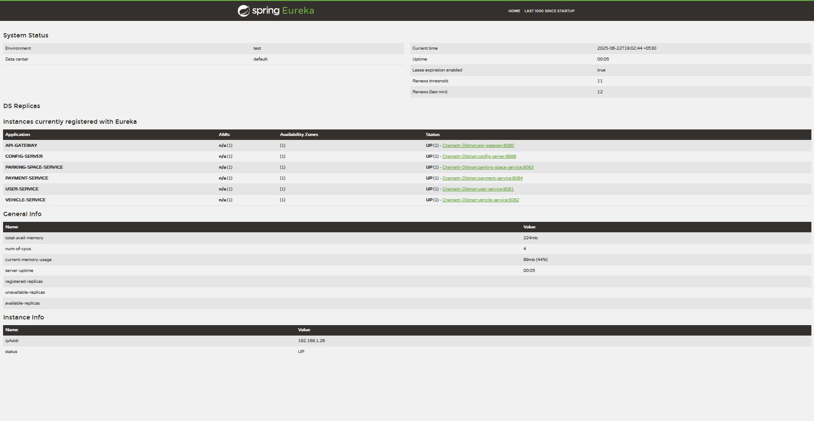

# Smart Parking Management System (SPMS)
*Microservice-Based Application*

## Overview

The Smart Parking Management System (SPMS) is a cloud-native, microservice-based platform designed to solve urban parking challenges through real-time management and monitoring of parking spaces. The system enables users to locate, reserve, and pay for parking while providing parking owners with comprehensive space management capabilities.


### Microservices Architecture

The system follows a microservices architecture pattern with the following components:

#### Infrastructure Services
- **Eureka Server** (Port 8761): Service registry and discovery
- **Config Server** (Port 8888): Centralized configuration management
- **API Gateway** (Port 8080): Single entry point and request routing

#### Business Services
- **User Service** (Port 8081): User registration and management
- **Vehicle Service** (Port 8082): Vehicle registration and tracking
- **Parking Space Service** (Port 8083): Parking space management and operations
- **Payment Service** (Port 8084): Payment processing and receipt generation

## Testing

### API Testing with Postman

The project includes a comprehensive Postman collection for testing all endpoints:

**Resources:**
- [Postman Collection](./postman_collection.json)

- ## Monitoring & Management

### Eureka Dashboard
Monitor service registration and health status:



### Technology Stack

| Technology | Purpose |
|------------|---------|
| **Spring Boot** | Core framework for microservices development |
| **Spring Cloud Eureka** | Service registry and discovery |
| **Spring Cloud Config** | Centralized configuration management |
| **Spring Cloud Gateway** | API Gateway for routing and load balancing |
| **Spring Web** | RESTful API development |
| **Lombok** | Reducing boilerplate code |
| **Maven** | Dependency management and build automation |

## Features

### User Management
- Customer and parking owner registration
- User profile management
- Authentication and authorization

### Vehicle Management
- Vehicle registration and tracking
- Support for multiple vehicle types (CAR, MOTORCYCLE, VAN)
- Vehicle entry/exit simulation

### Parking Space Management
- Dynamic parking space creation and management
- Multiple space types (STANDARD, COMPACT, DISABLED, EV_CHARGING)
- Real-time availability tracking
- Space reservation and occupation management
- Location and zone-based filtering

### Payment Processing
- Secure payment processing with multiple methods
- Automatic fee calculation with tax
- Digital receipt generation
- Payment validation and refund processing
- Comprehensive payment statistics

## API Documentation

### User Service Endpoints
- `POST /api/users/register` - Register new user
- `GET /api/users` - Get all users
- `GET /api/users/{userId}` - Get user by ID
- `PUT /api/users/{userId}` - Update user information

### Vehicle Service Endpoints
- `POST /api/vehicles/register` - Register new vehicle
- `GET /api/vehicles` - Get all vehicles
- `GET /api/vehicles/{vehicleId}` - Get vehicle by ID
- `GET /api/vehicles/user/{userId}` - Get vehicles by user
- `POST /api/vehicles/{vehicleId}/entry` - Simulate vehicle entry
- `POST /api/vehicles/{vehicleId}/exit` - Simulate vehicle exit

### Parking Space Service Endpoints
- `POST /api/parking-spaces/create` - Create new parking space
- `GET /api/parking-spaces` - Get all parking spaces
- `GET /api/parking-spaces/available` - Get available spaces
- `GET /api/parking-spaces/location/{location}` - Filter by location
- `POST /api/parking-spaces/{spaceId}/reserve` - Reserve space
- `POST /api/parking-spaces/{spaceId}/occupy` - Occupy space
- `POST /api/parking-spaces/{spaceId}/release` - Release space
- `GET /api/parking-spaces/stats` - Get parking statistics

### Payment Service Endpoints
- `POST /api/payments/process` - Process payment
- `POST /api/payments/calculate-fee` - Calculate parking fee
- `GET /api/payments` - Get all payments
- `GET /api/payments/{paymentId}/receipt` - Get payment receipt
- `POST /api/payments/{paymentId}/refund` - Process refund
- `GET /api/payments/stats` - Get payment statistics

## Getting Started

### Prerequisites

- Java 17 or higher
- Maven 3.6+
- Git

### Installation & Setup

1. **Clone the repository**
   ```bash
   git clone https://github.com/ChamathDilshanC/Smart-Parking-Management-System-Microservice-Based-Application.git
   cd Smart-Parking-Management-System-Microservice-Based-Application
   ```

2. **Start services in the following order:**

   ```bash
   # 1. Start Eureka Server (Service Discovery)
   cd eureka-server
   mvn spring-boot:run
   
   # 2. Start Config Server (Configuration Management)
   cd config-server
   mvn spring-boot:run
   
   # 3. Start API Gateway
   cd api-gateway
   mvn spring-boot:run
   
   # 4. Start Business Services (can be started in parallel)
   cd user-service
   mvn spring-boot:run
   
   cd vehicle-service
   mvn spring-boot:run
   
   cd parking-space-service
   mvn spring-boot:run
   
   cd payment-service
   mvn spring-boot:run
   ```

3. **Verify deployment**
   - Eureka Dashboard: http://localhost:8761
   - API Gateway Health: http://localhost:8080/actuator/health

### Service Ports

| Service | Port | Purpose |
|---------|------|---------|
| Eureka Server | 8761 | Service Registry |
| Config Server | 8888 | Configuration Management |
| API Gateway | 8080 | Request Routing |
| User Service | 8081 | User Management |
| Vehicle Service | 8082 | Vehicle Operations |
| Parking Space Service | 8083 | Parking Management |
| Payment Service | 8084 | Payment Processing |

### Test Categories

1. **Health Checks**: Verify all services are running
2. **Direct Service Testing**: Test individual microservices
3. **Gateway Testing**: Test routing through API Gateway
4. **Complete Flow Testing**: End-to-end workflow simulation

### Sample Test Flow

1. Register a customer
2. Register a vehicle
3. Find available parking spaces
4. Reserve a parking space
5. Calculate parking fee
6. Process payment
7. Occupy parking space
8. Generate receipt
9. Release parking space
10. Complete vehicle exit

### Health Check Endpoints

All services expose health check endpoints:
- `GET /{service}/actuator/health`

### Service Discovery

Services automatically register with Eureka and can discover each other using service names:
- `lb://USER-SERVICE`
- `lb://VEHICLE-SERVICE`
- `lb://PARKING-SPACE-SERVICE`
- `lb://PAYMENT-SERVICE`

## Project Structure

```
smart-parking-management-system/
├── eureka-server/              # Service Registry
├── config-server/              # Configuration Server
├── api-gateway/                # API Gateway
├── user-service/               # User Management Service
├── vehicle-service/            # Vehicle Management Service
├── parking-space-service/      # Parking Space Service
├── payment-service/            # Payment Processing Service
├── docs/                       # Documentation
│   └── screenshots/            # System Screenshots
├── postman_collection.json    # API Testing Collection
├── README.md                   # Project Documentation
└── pom.xml                     # Root Maven Configuration
```

## Business Logic

### User Types
- **CUSTOMER**: End users who use parking services
- **PARKING_OWNER**: Providers of parking spaces
- **ADMIN**: System administrators

### Vehicle Types
- **CAR**: Standard passenger vehicles
- **MOTORCYCLE**: Two-wheeled vehicles
- **VAN**: Larger commercial vehicles

### Parking Space Types
- **STANDARD**: Regular parking spaces
- **COMPACT**: Smaller vehicle spaces
- **DISABLED**: Accessibility-compliant spaces
- **EV_CHARGING**: Electric vehicle charging spaces

### Payment Methods
- **CREDIT_CARD**: Credit card payments
- **DEBIT_CARD**: Debit card payments
- **DIGITAL_WALLET**: Mobile wallet payments
- **CASH**: Cash payments (simulated)

## Contributing

1. Fork the repository
2. Create a feature branch (`git checkout -b feature/new-feature`)
3. Commit your changes (`git commit -am 'Add new feature'`)
4. Push to the branch (`git push origin feature/new-feature`)
5. Create a Pull Request

## Future Enhancements

- Real-time IoT sensor integration
- Mobile application development
- Advanced analytics and reporting
- Machine learning for demand prediction
- Integration with city traffic management systems

## Contact

**Author**: Chamath Dilshan  
**GitHub**: [ChamathDilshanC](https://github.com/ChamathDilshanC)  
**Project**: ITS 1018 – Software Architectures & Design Patterns II  
**Institution**: IJSE - Graduate Diploma in Software Engineering

## License

This project is developed as part of an academic assignment for the Graduate Diploma in Software Engineering program.

---

*Smart Parking Management System - Making urban parking intelligent and efficient.*
